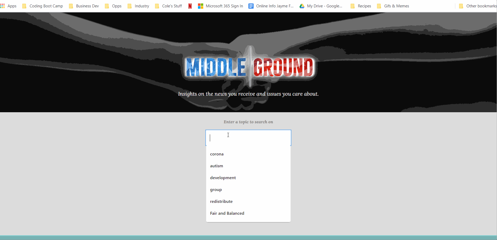

# Middle|Ground

Middle|Ground aims to shine a light on the imbalanced and sometimes inaccurate news we receive through social media, and promote greater perspective and dialogue about issues of social importance.  Inspired by the Blue Feed Red Feed visual created by the Wall Street Journal in 2016, Middle|Ground v1 offers side-by-side comparison of social media streams from the top “liberal” and “conservative” news sources.  Users can search by topic of interest and see how these topics are represented on social media by the news sources deemed "most reliable" by people who identify their views on a spectrum from conservative to liberal.  In addtiion, Middle|Ground harnesses the Google Fact Check API to show any claims related to the topic which have been fact-checked and any conclusion reached on whether the claims are partly or mostly true or false.

## Contents | Quick Links
[Getting Started](#start)     |     [Demo](#demo)     |     [Built With](#built)     |     [Authors](#author)     |     [Visuals](#visuals)     |     [Contributing & Tests](Contributing.md)     |     [Contact](#contact)

## [Getting Started](#start)

### Download the app from Git Hub here:
* [Repo URL](https://github.com/seyouny/MiddleGround)

### <a id="demo">View a demo:</a> 
* [Deployed on Heroku](https://rocky-meadow-78317.herokuapp.com/#demo)

## [Visuals](#visuals)

## <a id="built">Built With</a>
* HTML5 & CSS
* [Javascript](https://www.javascript.com/)
* [MySql](https://www.mysql.com/)
* [VS Code](https://code.visualstudio.com/)
* [Node.js](https://nodejs.org/)
* [NPM](https://www.npmjs.com/)
* [Express.js](https://expressjs.com/)
* [Handlebars](https://handlebarsjs.com/)
* [Sequelize](https://sequelize.org/)
* [jQuery](https://jquery.com/)
* [Axios](https://www.npmjs.com/package/axios)
* [Heroku](https://www.heroku.com/)
* [Curator\.io API](https://curator.io/)
* [Google Fact Check API](https://developers.google.com/fact-check/tools/api)

## <a id="contact">Questions</a>
For questions or to discuss collaborations on this or other projects, contact the authors via LinkedIn or GitHub as follows.

## <a id="author">Authors</a>
**Bart Dority** 
[linkedin.com/in/bart-dority](https://www.linkedin.com/in/bart-dority) 
[github.com/b0rgbart3](https://github.com/b0rgbart3)

**Seyoung "Stacey" Yoon** 
[/.....?](https://www.linkedin.com/in/.....?) 
[/seyouny](https://github.com/seyouny)

**Donna Nguyen** 
[linkedin.com//donna-nguyen-a71854b8](https://www.linkedin.com/in/donna-nguyen-a71854b8/) 
[github.com/donnaxnguyen](https://github.com/donnaxnguyen)

**Jen Jayme** 
[linkedin.com/jenjayme](https://www.linkedin.com/in/jenjayme) 
[github.com/jenjayme](https://github.com/JenJayme)

## Acknowledgements
* Special thanks to Jerome Chenette, Berkeley Coding Boot Camp and Trilogy for referring this project.  
* Inspired by the "Blue Feed / Red Feed" visual published by the Wall Street Journal, now inactive but archived [here](https://graphics.wsj.com/blue-feed-red-feed/))
* Informed by data from the [Pew Research Center](https://www.pewresearch.org/) including [The American News Pathways Survey (June 2020)](https://www.journalism.org/2020/07/30/americans-who-mainly-get-their-news-on-social-media-are-less-engaged-less-knowledgeable/)
* Shout out to Fred Rodolfo for critical advice and support, and to Bart Dority for generous assistance in troubleshooting.